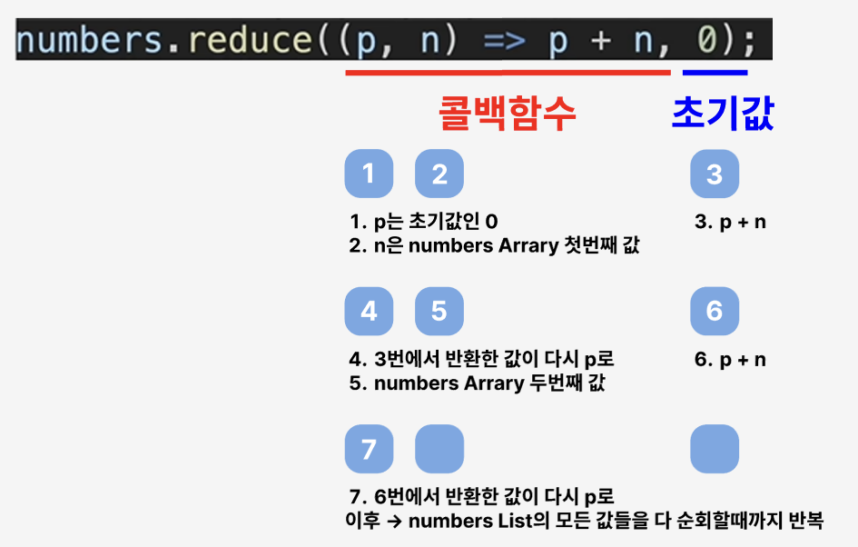
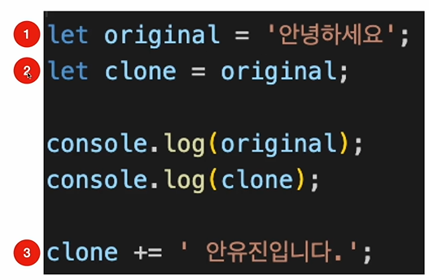
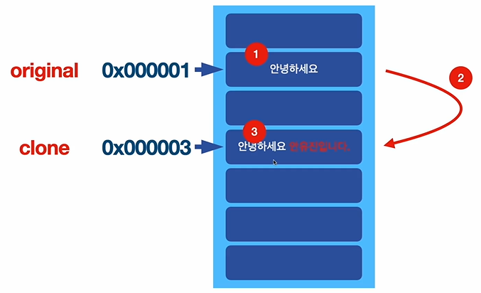
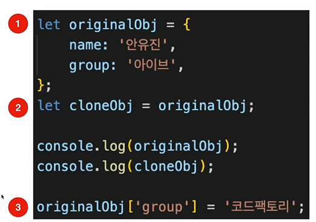
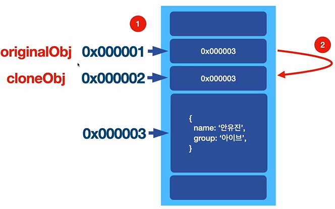
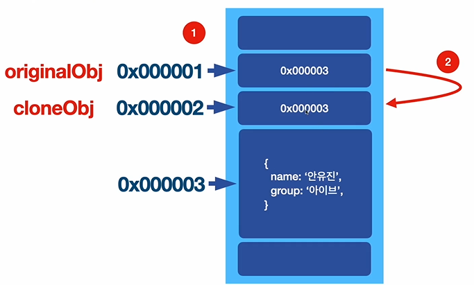
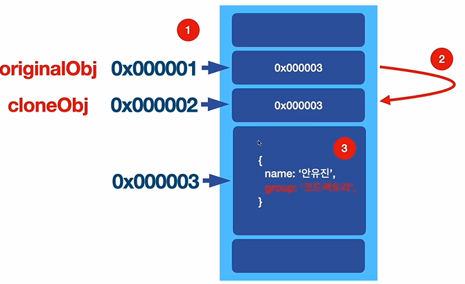

# 13_must_know_array_functions

### Reduce()

# 15_copy_by_value_and_reference

## Copy by Value

1. 변수 선언과 초기화
2. clone 변수에 original 변수 복사
3. clone 변수에 글자 추가

clone 변수가 가르키고 있는 메모리 공간에만 글자가 추가가 되고
original 가르키고 있는 메모리 공간은 그대로

## Copy by Reference

1. original Object 선언
2. clone Object에 original Object 복사
3. original Object의 키의 값을 변경

original Object는 다른 주소를 가지고 있는데, 이 주소는 실제 Object가 저장되어 있는 메모리 공간을 가리킨다

복사된 clone Object 또한 실제 Object가 저장되어 있는 메모리 공간을 가리킨다.

메모리 공간에 저장되어 있는 Object의 키 값이 바뀌었기 때문에 주소를 가리키고 있는 original Object, clone Object의 값이 모두 동시에 변경 된다.
=> 실제 객체가 변경이 될 때, 이 객체를 바라보고 있는 모든 변수들이 전부 값이 동시에 변경이 된다.