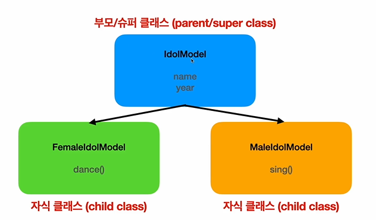

# Class

- class : 특정 **객체(인스턴스)**를 생성하기 위한 변수와 메소드(객체 안에 있는 함수)를 정의하는 틀

- 클래스 : 이름, 나이 라는 프로퍼티를 정의
- 인스턴스 : 실제 데이터를 구현한 것
- 인스턴스화 : 클래스를 객체로 만드는 과정

# Inheritance

- inheritance(상속) : 겍체들 가의 관계를 구축하는 방법. 수퍼클래스, 또는 부모 클래스 등의 기존의 클래스로부터 속성과 동작을 상속받을 수 있다.

