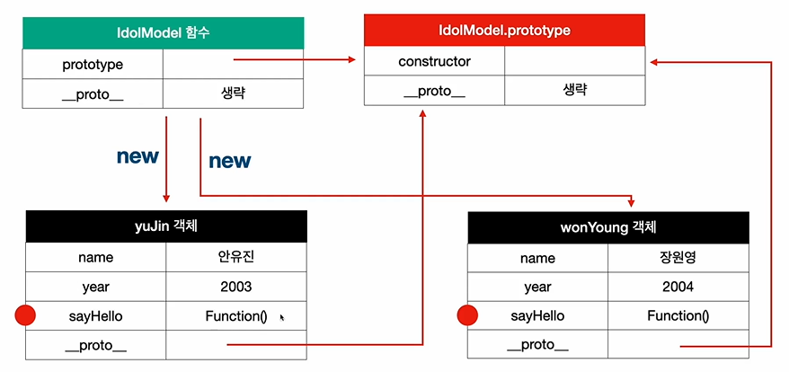
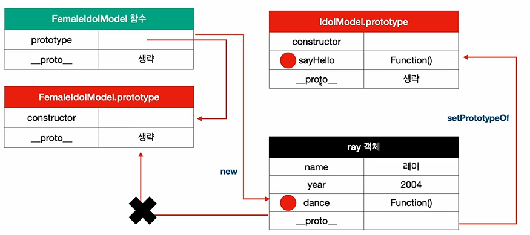
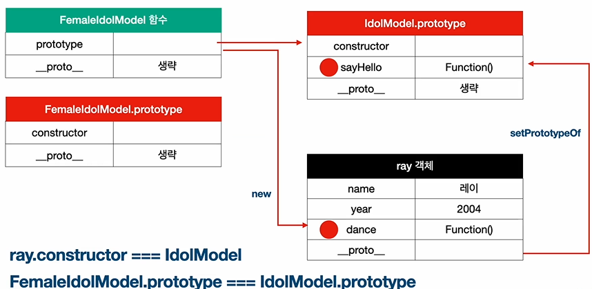

# ProtoType Chain ( 프로토타입 체인 )

| yuJin 객체 | yuJin 객체 |
|:------:|:------:|
| name | 안유진 |
| year | 2003 |
| __proto__ |    |

- ___proto 가 자동으로 생김
- yuJin 객체의 __proto__는 IdolModel.prototype을 가리킨다.
- IdolModel 에서 new 키워드를 사용해서 yuJin 객체를 생성함.
- idolModel과 yuJin 객체의 상관관계는 new 키워드를 통해서 이어진다.

| IdolModel | .prototype |
|:------:|:------:|
| constructor |  |
| __proto__ | ??? |

- IdolModel.prototype의 constructor은 IdolModel 함수를 가리킨다.

| IdolModel | IdolModel |
|:------:|:------:|
| prototype |  |
| __proto__ | ??? |

- IdolModel 의 prototype은 IdolModel.prototype을 가리킨다.
- IdolModel 과 IdolModel.prototype은 서로가 서로를 참조한다.
- IdolModel 의 prototype이 yuJin 객체의 __proto__ 가 된다.
- IdolModel.__proto__ 는 Function.prototype을 가리킨다.

- new 키워드로 함수의 객체를 생성할 때는 실체 함수의  prototype 값을 __proto__ 에 넣게 된다.
- => 상속 체인에서의 바로 위 역할을 한다. (상위)

| Function | .prototype |
|:------:|:------:|
| __proto__ |  |

- Function.prototype.__proto__ 는 Object.prototype을 가리킨다.

- **모든 값들의 최상위 proto 값은 전부 Object.prototype을 가리킨다.**
- **상속 체인의 가장 최상위에는 Object.prototype이 존재한다.**

## Chain 의 장점
- __proto__ 는 무언가의 prototype을 reference한다.

- 객체를 생성할 때마다 sayHello라는 함수가 매번 새로 생성이 됨
- yuJin.sayHello === wonYoung.sayHello  => F (다른 메모리 공간을 차지)

- IdolModel.prototype에 sayHello를 선언하게 되면 yuJin 객체는 IdolModel 프로토타입을 상속받고
    wonYoung 객체도 IdolModel.prototype 을 상속받는다.

---
---

| IdolModel | 함수 |
|:------:|:------:|
| prototype |  |
| __proto__ |  |

| gaEul | 객체 |
|:------:|:------:|
| name | 가을 |
| year | 2002 |
| __proto__ |  |

- IdolModel 함수의 new 키워드를 통해서 생성이 되었기 때문에, 
가을 객체의 proto 값은 IdolModel.prototype

| IdolModel | 함수 |
|:------:|:------:|
| constructor |  |
| sayHello | Function() |
| __proto__ |  |

**ray.constructor === IdolModel (T)**

- setPrototypeOf 를 하면서 프로토 값을 IdolModel.Prototype 로 변경했다.
- 객체의 프로토를 직접적으로 이미 생성이 된 다음에 변경을 할 때, 함수의 프로토타입은 
    그대로 유지가 되고, 생성된 객체가 연결되었던 프로토타입과의 연결만 끊어진다.

- prototype을 직접적으로 함수에서 변경했을 때 일어나는 현상
- 함수의 프로토타입을 직접 변경한 경우에는 생성자 함수와 원래 프로토타입과의 연결만 끊어지고
    나머지는 예상대로 연결이 된다.