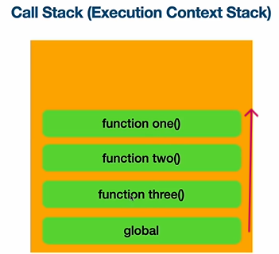
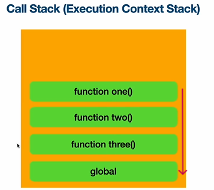

# execution_context(1) (실행 컨텍스트 (문맥?))

- 실행하려는 JS코드와 실행할때 필요한 정보를 담고있는 특수한 환경
코드 실행에 필요한 모든 데이터를 들고있는 환경
    - Global Context : 최상위 Execution Context 코드를 실행하면 무조건 생성되는 context로 웹에서의 window 객체나 nodeJS에서의 global 객체를 생성하고 들고있다.
    - Function Context : 함수가 실행될때마다 함수별로 실행되는 context
    함수 실행에 대한 모든 정보를 갖고있는다.

1) Memory Heap & Call Stack
- JavaScript 파일을 일반적인 방법으로 실행하면 싱글스레드로 실행이 된다.
    - 싱글스레드 안에 하나의 메모리 힙과 콜스택이 존재 
- Call Stack(Execution Context Stack)
    - 함수를 실행할 때마다 스택에 올라가고 함수가 끝날때마다 위에서부터 사라지는 형태

실행 시작(위로 쌓인다.)

실행 끝(위에서부터 사라진다.)

- 아예 실행이 전부 끝나면 global execiton context도 사라진다

1. Creation Phase (변수랑 함수를 미리 메모리힙에 배정)
    - Global Object 생성. window 또는 global 객체가 생성되고 함수에서는 arguments 객체가 생성
    - this를 window 또는 global에 바인딩
    - 변수와 함수를 Memory Heap에 배정하고 기본값을 undefined로 저장

2. Execution Phase (실제 실행)
    - Creation Phase가 먼저 실행된 다음에 실행이 된다.
    - 코드를 실행
    - 필요시 새로운 Execution Context 생성

# execution_context(2)