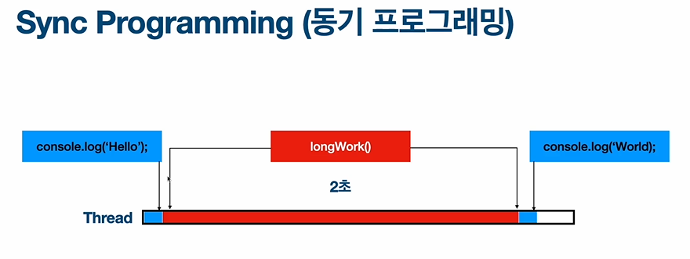
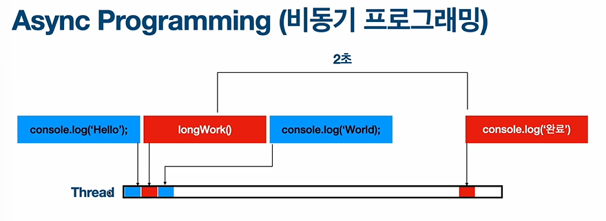

# Async theory

- Sync Programming (동기 프로그램)

- ASync Programming (비동기 프로그램)

- Event Loop
    - JavaScript 런타임이 생성되는 순간에 생성된다.
    - Task Queue 안에 실행이 종료가 된 함수가 있는지를 확인

    - Call stack이 비어있는지 확인
    
    - 큐안에 있는 함수가 종료가 됐을 때 Call Stack이 비어있으면 Event Loop가 종료도니 함수를 다시 Call Stack으로 이동